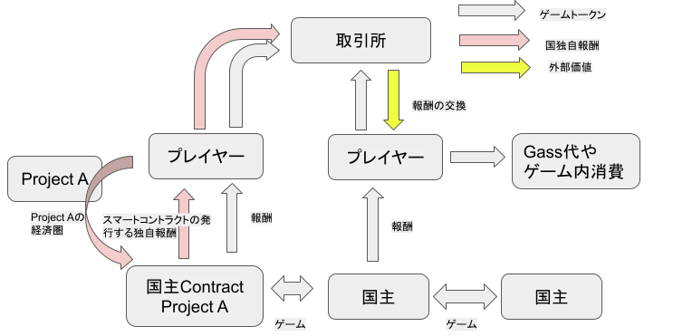

<samp>
<div align="center">

# Chain Justice
[](https://goreportcard.com/report/github.com/chain-justice/chain-justice)
</div>

## What is Chain Justice

Chain Justice is a Blockchain Game running **as** a Blockchain.  
Game rule is written in a chain and everyone can create sub game on it!!

## プロジェクト概要
ゲームのロジックを書き込んだ専用ブロックチェーンを作成し、DecentralizedGameFiを提案します。
プレーヤー同士でチーム（国）として協力し、国同士で資金を奪い合います。他国への攻撃やその準備などを協力して行う必要があります。ゲームの報酬は国を設立したプレーヤーにのみ支払われます。そのため、プレーヤーは自ら報酬設計を行う楽しみと必要があります。
さらに、このチェーンではウォレットアドレスをプレーヤーと扱うため、スマートコントラクトを国主として据えることで報酬を保証したり、人とのしての信頼で仲間を集めたり、オフチェーンサーバーで自動化もでき、プレーの多様性が生まれます。
スマートコントラクトを国主として、ERC20やNFTで報酬を支払うこともできます。つまり、ゲームの経済圏の中に新しいプロダクトと経済圏を作ることもできるのです。
ゲームロジックや報酬の仕組みもすべてが非中央集権的なゲームとなっています。
CosmosSDKを使っているため、外の経済との接点は開発は用意にできるでしょう。
今回は短い開発期間ということもあり、チェーンの作成とプレーのデモを行いました。

## Demo Video


<div align="center">

[](https://www.youtube.com/watch?v=k3coKI7HfaA)
</div>
   
## Game Rule
Chain Justiceは、プレイヤー同士がチーム（国）として協力し、他のチーム（国）と競い合うゲームです。   
ユーザーはまず、国に所属するか建国するかを選ぶことができます。  
国に所属したら、または建国したら、他の国に攻めることができます。
現在の仕様では、Invasionした場合相手の国のトークンを1%奪うことができます。  
ただし、攻撃には10の食糧が必要となります。食糧は Prepare を行うことで国に蓄えられていきます。 
それぞれのアクションには完了まで一定の時間が必要となります（ブロックの高さにより実装）。デモでは10秒程度ですが、30分や6時間など任意の時間に設定することができ、コミュニティやゲームの質を調整することが可能です。

### 建国・所属
Faucet等で、トークンを取得したアクティブウォレットアカウントは、国を作ったり、所属したりすることができる。
#### FundCountry
ユーザーは自分を国主として、国を建国することができます。その際、国のアドレスはユーザーのウォレットアドレスとなります。

#### BelongCountry
ユーザーは他の人が作った国に所属し、一員として Prepare・Invasionを行うことができます。

### 攻撃・準備
国に所属したユーザーは、食糧を生産する Prepare と、食糧を消費して他の国のトークンを奪う Invasion を行うことができます。
#### Prepare
Prepareのアクションには、一定のブロック（デモでは10ブロック）が生成されるまで待つ必要があります。  
PrepareStartのリクエストを行うと、Prepareを開始します。Prepareを開始した後、PrepareResultのリクエストを行うことができます。  
PrepareResultでは、ブロックの高さが十分であれば結果を反映・確認することができます。現在の生産される食糧の量は`5 + Block Height %5`で決定されます。

#### Invasion
Invasion、一定のブロック（デモでは10ブロック）が生成されるまで待つ必要があります。  
InvasioneStartのリクエストを行うと、Invasionを開始します。Invasionを開始した後、InvasionResultのリクエストを行うことがでます。  
InvasionResultでは、ブロックの高さが十分であれば結果を反映・確認することができます。現在奪うことができるトークンは相手の`1%`となっています。
奪ったトークンは、ユーザーではなく、国主のアドレスへと送金されます。

### その他の要素
国主以外のユーザーは攻撃をしてもトークンを得ることができないが、国主は他の国からトークンを奪い資金を守るためには他のユーザーの協力が必要となります。  
国主は協力したユーザーに報酬を送金して協力関係を維持しましょう！  
国主ユーザーを自動化してもいいですし、スマートコントラクトを国主にできるようアップデートされる予定です。  
コントラクトを用いて民主主義国家や共産主義国家などを作ってもいいでしょう。

## Game Vision
チェーン自体にゲームの法則を記述しましたが、どうプレーするかはユーザーに委ねられています。  
また、NFTゲームや従来のBlockchain Gameとことなり、ユーザー自身が報酬系に関して創造することができます。  
デモでは、コントラクトによる建国は行っていませんが、今後対応する予定です。  
コントラクトによる国主は、新しい経済圏を作ることができます。報酬を ERC20やERC721で支払う事も可能だからです。  
ゲームに付随する新しい機能やサブゲームを開発していくことで、チェーン全体も活性化し、ゲーム自体もより面白いものになるでしょう。

ハッカソンに向けて、Smallに作りましたが、以下のアップデートを考えています。
1. プレイヤーにステータスを設ける（トークンの消費先）
1. 国の所属人数上限
1. 奪うトークンの計算式のアップデート
1. Cosmwasm or Ethermint によるスマートコントラクト基盤
1. スマートコントラクトによる国の作成

## Token Economics
プレイヤーはゲームをプレイすることで、国主から報酬を受けます。  
報酬はゲーム内で消費するか、外部の価値に交換することができます。  
また、国主は独自のERCトークンなどを報酬にすることができ、内部に独自の経済圏を作ることも可能です

<div align="center">


</div>

## Technical Description
以下の技術を用いました
1. Cosmos SDK
   1. chainの生成
   1. Blockchain の module の作成
1. Vue
   1. chainとの接続（starportをもとに新しくコンポーネントを作成・一部既存バクの修正）
   1. 操作画面の作成

スマートコントラクトのコードは、`./x/` 配下の goファイルとなります。  

## How to try Demo
### Demo Version

Local環境で`ignite chain serve`を行うか、11/6 ~ 11/14 の間、[こちら](http://3.19.251.152)で公開しております。  
ノードとウェブページの両方が稼働しているため、少し動作が重いですが、ご了承ください。

1. ChromeにCosmos系のウォレットである [Keplr](https://chrome.google.com/webstore/detail/keplr/dmkamcknogkgcdfhhbddcghachkejeap?hl=ja)をインストール
1. Keplrウォレットでウォレットを作成
1. 上記のリンク、または localで実行している場合は localhost へアクセス
1. 右上の Connect Walletからウォレットを連携
1. Faucetからトークンを取得しましょう
1. 左上のメニューから Gameを選択
1. Fund Countryか、他の人がすでに国を作っていれば Belong to Countryを実行しましょう
1. 国に所属したら、Prepareから食糧をつくりInvasionから他国に攻撃しましょう
   1. StartPrepare / StartInvasion で開始します。10ブロックの生成（およそ10秒）間、他の行動を取ることはできません。
   1. CheckResultPrepare/ CheckResultInvasion を実行すると、十分な時間が経過していれば、アクションの結果が反映されます。（自動では行動の結果は反映されません）
1. Prepare で食糧が増え、Invasionでトークンが増え食糧が減ることを確認しましょう。国主の場合は、自分のトークンが上限します！


### Try on a Local Computer
Cosmos Sdk を用いているので、一般的な方法でチェーンを起動することができます。  
以下の環境をご用意ください
```
ignite version 0.25.1 (2022.11.12 時点最新)
node version 18.5 以上
npm version 8.8 以上
```

1. `ignite chain serve --reset-once` でチェーンを起動します。
1. 別のターミナルを起動し、`ignite generate ts-client`, `ignite generate vuex` を実行し、クライアントのファイルを更新します。
1. `cd ts-client && npm i && cd ..` を実行
1. `cd vue && npm ci && npm run dev` でクライアントを起動します。
1. Google Chrome にCosmos系のウォレットのKeplrをインストールします。
1. Google Chrome で localhost:3000 へアクセスし、Keplrを連携します。
1. Faucet から token を取得して、遊びましょう！

### Try this chain as blockchain node
実行ファイルとしてビルドし、実行する場合は以下の手順となります。
  
```
ignite chain build --clear-cache --output ./ 
./chain-justiced init shohet --chain-id justice
./chain-justiced keys add shohet
./chain-justiced add-genesis-account <上で出てきたアドレス> 1000000token,100000000stake
./chain-justiced gentx shohet 1000000stake --chain-id justice
./chain-justiced start
```

</samp>
